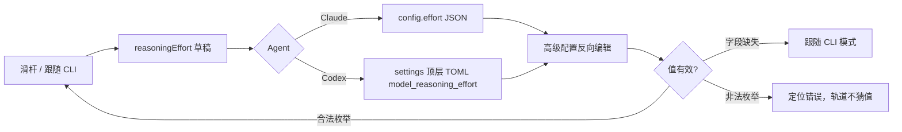
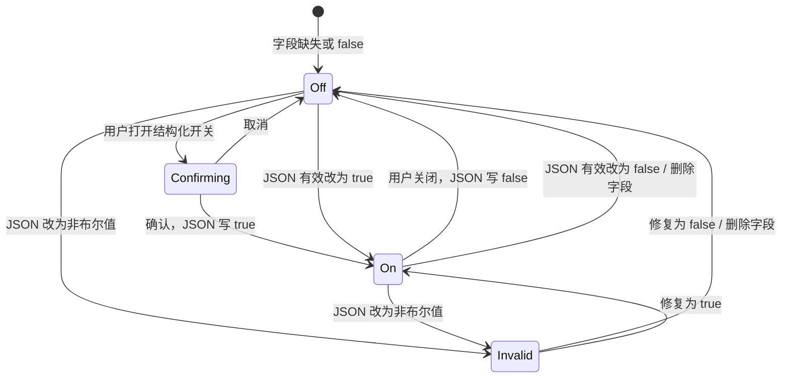

# Provider 思考强度与执行权限 Follow-up 低保真原型

- **关联 Spec**：`.agent-tower/spec/2026-07-15-provider-effort-permission-followup-spec.md`
- **视觉参考**：用户附件中的 Codex 五档分段滑杆，仅参考结构和交互语义。
- **目标**：把 Claude/Codex 思考强度从 Select 改为五档离散滑杆；在高级配置顶部恢复 Agent 专属执行权限开关。
- **边界**：只说明交互、层级和状态，不规定最终视觉或像素；不修改业务代码、不新增细粒度 sandbox/approval policy。

## 1. 页面层级

```text
Provider 编辑
├─ 基本配置
│  ├─ API 地址 / Key / 模型
│  └─ 思考强度（仅 Claude Code / Codex）
│     ├─ “跟随 CLI”独立模式
│     └─ 五档离散滑杆 + 当前档标签
└─ 高级配置
   ├─ 执行权限（首个区域，Agent 专属单开关）
   ├─ 运行配置 JSON
   ├─ 环境变量
   └─ 原生配置 / settings
```

Gemini CLI、Cursor Agent 不显示思考强度空控件；四类 Agent 均按自身映射显示一个执行权限开关。

## 2. 五档离散滑杆

### 档位映射

| Agent | 从“更高效”到“更智能” | 持久化位置 |
| --- | --- | --- |
| Claude Code | 低 `low` / 中 `medium` / 高 `high` / 超高 `xhigh` / 最高 `max` | `config.effort` |
| Codex | 最低 `minimal` / 低 `low` / 中 `medium` / 高 `high` / 超高 `xhigh` | `settings.model_reasoning_effort` |

界面显示中文标签；Provider 只保存底层枚举，不保存中文文案。

### 桌面默认：自定义模式

```text
思考强度                                      [ 跟随 CLI  ○ ]

更高效                                                       更智能
┌──────────────────────────────────────────────────────────────────┐
│  ●────────────●────────────◉────────────○────────────○            │
│  1            2            3            4            5            │
└──────────────────────────────────────────────────────────────────┘
                      当前：中（medium）
```

- 轨道总高度固定；当前值标签预留单行高度，档位切换、hover、focus 不改变布局。
- 已选轨道到当前刻度；未选轨道保持中性。滑块只能吸附到五个刻度，不存在中间值。
- 两端只持续显示“更高效 / 更智能”，不在轨道下常驻五个长标签。

### “跟随 CLI”：独立无值模式

```text
思考强度                                      [ 跟随 CLI  ● ]

更高效                                                       更智能
┌──────────────────────────────────────────────────────────────────┐
│  ○────────────○────────────○────────────○────────────○            │  禁用、中性
└──────────────────────────────────────────────────────────────────┘
                         当前：跟随 CLI
```

- 轨道禁用且不显示选中滑块，避免误读为最低档。
- 开启“跟随 CLI”时删除显式覆盖：Claude 删除 `config.effort`；Codex 无损移除顶层 `model_reasoning_effort`。
- 关闭“跟随 CLI”时恢复本次草稿最近一次显式档位；无历史值时选 `medium`。
- 仅打开页面不产生差异；用户切换模式后才更新草稿。

### 交互状态表

| 状态 | 低保真表现 | 行为 |
| --- | --- | --- |
| Default | 当前滑块、已选轨道、固定当前值标签 | 点击刻度/轨道选最近档；拖动逐档吸附 |
| Hover | 目标刻度/滑块出现轻量轮廓；当前标签不移动 | 可预览目标档文案，但不依赖 hover 完成交互 |
| Focus | 整个滑杆出现可见焦点环 | 左/下减一档，右/上加一档，Home/End 到首/末档 |
| Active/drag | 滑块按压态，仍只落在刻度 | 阻止页面横向滚动与弹窗误关闭 |
| Disabled | 中性轨道、无滑块、`跟随 CLI` 文案 | 轨道不可 Tab 聚焦；模式控制仍可聚焦 |
| Invalid enum | 轨道不猜测位置；显示字段错误 | 阻止测试/保存，不自动夹到最近合法值 |

屏幕阅读器：滑杆提供 `aria-valuemin=1`、`aria-valuemax=5`、`aria-valuenow` 和本地化 `aria-valuetext`，例如“高，high”；“跟随 CLI”需要独立可读名称和开关状态。

### 390px 移动布局

```text
┌──────────────────────────────────────┐  viewport 390px
│ 思考强度                             │
│ [ 跟随 CLI  ○ ]                     │  ≥44px 控件热区
│                                      │
│ 更高效                        更智能 │
│ ┌──────────────────────────────────┐ │
│ │ ●──────●──────◉──────○──────○   │ │  轨道视觉居中
│ └──────────────────────────────────┘ │  整行触控热区 ≥44px
│ 当前：中（medium）                   │  固定单行占位
└──────────────────────────────────────┘
```

- 控件内容宽度自适应容器；五个刻度等距，端点标签不与滑块/当前值重叠。
- 开关、每个可点刻度和滑杆拖动区域的触控热区至少 44px；视觉圆点可小于热区。
- 当前标签预留固定高度；从短标签切换到“最高（max）”也不推动后续内容。
- `touch-action` 语义只接管横向滑杆手势，页面仍可纵向滚动；遵守 reduced-motion，选中状态不依赖动画。

## 3. 思考强度双向同步



同步反馈：

- 合法反向修改：字段下显示 `高级配置已更新：高（high）`，随后进入普通已同步状态。
- 缺失映射：立即切到“跟随 CLI”，不制造默认值。
- 简化/高级冲突：沿用现有 `采用简化值 / 保留高级值`，不设隐藏优先级。
- Codex 移除或更新映射时保留 TOML 未知字段、空行、表段、前置和行尾注释。
- 非法枚举示例：`不支持的思考强度 "ultra"；请改为 minimal/low/medium/high/xhigh 或删除该字段以跟随 CLI`。

## 4. 高级配置顶部：执行权限

### 展开状态

```text
┌─ 高级配置 ▾ ──────────────────────────────────────────────────────────────┐
│ 执行权限                                                     [开关：开启] │
│ 跳过所有确认和沙盒（Codex）                                              │
│ ! 高风险执行已开启：会跳过确认并禁用沙盒保护。                           │
│                                                                          │
│ 运行配置 (JSON)                                             已同步 ✓      │
│ ┌──────────────────────────────────────────────────────────────────────┐ │
│ │ {                                                                    │ │
│ │   "dangerouslyBypassApprovalsAndSandbox": true,                      │ │
│ │   "unknownOption": "keep"                                           │ │
│ │ }                                                                    │ │
│ └──────────────────────────────────────────────────────────────────────┘ │
│                                                                          │
│ 环境变量 / 原生配置 / settings ...                                      │
└──────────────────────────────────────────────────────────────────────────┘
```

各 Agent 只显示对应真实运行字段：

| Agent | 用户文案 | JSON 字段 | 运行行为 |
| --- | --- | --- | --- |
| Claude Code | 跳过权限确认 | `dangerouslySkipPermissions` | `--dangerously-skip-permissions` |
| Gemini CLI | 自动批准操作（YOLO） | `yolo` | `--yolo` |
| Cursor Agent | 强制执行 | `force` | `--force` |
| Codex | 跳过所有确认和沙盒 | `dangerouslyBypassApprovalsAndSandbox` | `--dangerously-bypass-approvals-and-sandbox` |

### 首次从关闭切换到开启

```text
┌─ 开启高风险执行？ ──────────────────────────────────────────┐
│ 开启后，Codex 将跳过所有确认并禁用沙盒保护。                 │
│ 这可能允许 Agent 在无确认的情况下修改文件或执行命令。        │
│                                                            │
│                         [取消]  [确认开启高风险执行]          │
└────────────────────────────────────────────────────────────┘
```

- 取消：开关恢复关闭，JSON 和草稿均不改变。
- 确认：更新对应布尔字段为 `true`，开关开启，立即显示持续警示。
- 原本已开启的 Provider：打开编辑页不重复弹确认，但持续显示警示。
- 从开启切为关闭不弹风险确认，JSON 同步为 `false`；只有主动切换才写草稿。

### 高级配置折叠后

```text
[ 高级配置 ▸ ]     ! 高风险执行已开启
```

高风险状态始终在折叠标题旁可见，不把危险设置隐藏在折叠区中。新建自定义 Provider 默认关闭；已有/内置 Provider 保留原布尔值，不迁移、不反转。

### 390px 移动布局

```text
┌──────────────────────────────────────┐
│ 高级配置 ▾                           │
│ ! 高风险执行已开启                   │
├──────────────────────────────────────┤
│ 执行权限                             │
│ 跳过所有确认和沙盒                   │
│                           [ 开启 ● ] │  整行/开关热区 ≥44px
│ ! 将跳过确认并禁用沙盒保护。         │
├──────────────────────────────────────┤
│ 运行配置 (JSON)        已同步 ✓      │
│ [全宽编辑器；不造成页面横向滚动]     │
└──────────────────────────────────────┘
```

风险确认在移动端使用不超出 390px 的对话框/底部确认面板；危险确认按钮文案完整换行，不与取消按钮重叠。

## 5. 权限 JSON 双向同步与错误



同一份草稿、最后一次**有效**用户编辑立即同步另一视图，不维护第二份权限状态；未知 JSON 字段保持原样。

### 历史非布尔值错误

```text
执行权限   [状态不可用]
! 配置错误：dangerouslyBypassApprovalsAndSandbox 必须是布尔值。
  当前为字符串 "true"。请在运行配置 JSON 中改为 true、false 或删除字段。
  [定位到 JSON 字段]

运行配置 (JSON)
  3 | "dangerouslyBypassApprovalsAndSandbox": "true"
      ^ 必须为布尔值，不能使用字符串或 truthy 规则

[测试当前草稿：禁用]  [保存：禁用并显示“先修复执行权限字段”]
```

- 不把字符串、数字、对象或数组静默解释为开启/关闭。
- 保留历史原文与其他字段；只定位错误，不自动改写。
- 修复为 `true` 后开关开启并持续警示；修复为 `false` 或删除字段后开关关闭。
- 测试/保存被阻止；取消编辑与放弃草稿仍可用。

### 同步反馈状态

| 来源 | 有效修改 | 另一视图反馈 |
| --- | --- | --- |
| 结构化开关 | 确认开启 | JSON 对应字段变 `true`；`已同步 ✓` |
| 结构化开关 | 关闭 | JSON 对应字段变 `false`；`已同步 ✓` |
| JSON | 字段 `true` | 开关开启 + 持续高风险警示 |
| JSON | 字段 `false`/缺失 | 开关关闭；折叠高风险提示消失 |
| JSON | 非布尔值 | 开关不可用 + 字段错误；阻止测试/保存 |

## 6. 固定布局与状态检查

- 桌面：思考强度控件与高级配置沿用 Provider 表单单列主流程；当前标签与错误位均预留高度，状态切换不使保存区跳动。
- 390px 移动：所有可操作项至少 44px 热区；端点、轨道、当前值单独占行，不平铺五个长标签。
- Focus：模式开关、滑杆、权限开关、确认按钮均有可见焦点；Tab 顺序符合从上到下的信息层级。
- Disabled：用形状/文案同时表达，不只降低透明度；跟随 CLI 时轨道从键盘顺序中移除。
- Error：错误紧邻对应控件，并提供“定位到 JSON/TOML”动作；不靠 toast 作为唯一反馈。
- Reduced motion：滑块过渡可关闭；刻度、当前文案和风险图标始终表达状态。

## 7. 功能边界与待确认

### 未覆盖

- 最终颜色、阴影、圆角、动效时长和像素尺寸。
- Provider 数据模型、executor、API schema、TOML 编辑算法的工程方案。
- Codex read-only/workspace-write、approval policy、目录级权限等细粒度权限 UI。
- Gemini/Cursor 的思考强度、CLI 全局文件、整个 Provider 弹窗视觉重做。

### 待 PM / Tech Lead 确认（非产品阻塞）

1. 风险确认在 390px 移动端采用居中 Dialog 还是底部 Sheet，需沿用现有设置页模式。
2. 滑杆 hover 是否显示临时 tooltip，或仅用固定“当前档”标签；两者都不能造成布局变化。
3. 历史非布尔错误的“定位到 JSON”是否由现有编辑器支持行号聚焦；不支持时至少展开高级区并滚动到编辑器。
4. Provider 详情页的权限摘要应复用哪一个现有信息区，由技术计划结合当前详情布局决定。
