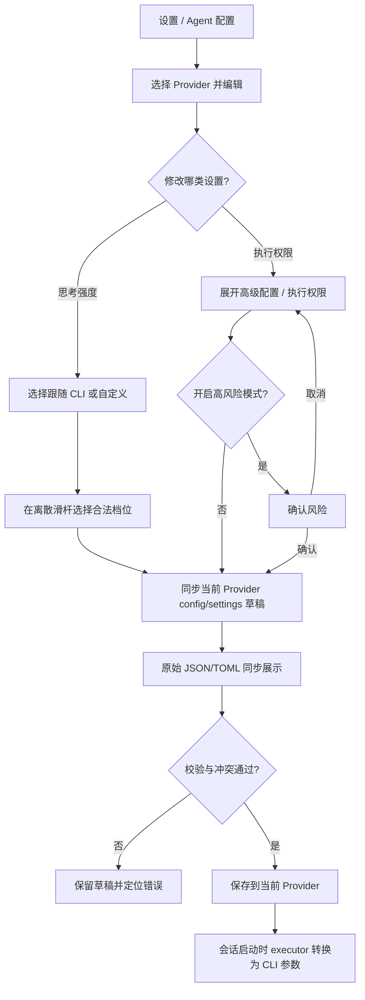

# Provider 思考强度与执行权限 Follow-up Spec

- 日期：2026-07-15
- 状态：用户需求已确认
- Spec Owner：产品经理
- User Confirmed：是
- Verdict：`READY_FOR_TECH_PLAN`
- 关联 Spec：`.agent-tower/spec/2026-07-15-simplified-provider-config-spec.md`
- 视觉参考：用户附件中的 Codex 离散分段滑杆

## 背景 / 真实目标

Provider 简化配置已经完成，但用户反馈“思考强度”仍是普通下拉框，视觉层级和选择反馈不够直观，希望参考 Codex 的离散分段滑杆。同时，简化改版把原先可点击的权限开关收进了“运行配置 (JSON)”，导致用户无法直接找到“跳过权限/沙盒”的设置。

本 follow-up 的真实目标是：

- 让思考强度看起来和操作起来都像一个有序、离散的“效率到智能”选择，而不是技术枚举下拉框。
- 恢复执行权限的结构化入口，让用户无需手写 JSON 即可查看和修改当前 Provider 的高风险执行模式。
- 继续只补强当前 Provider 界面及其 `config/settings` 草稿同步，不重构 Provider 系统，不修改任何本机 CLI 全局配置。

## 用户问题与回答

| 用户问题 | 结论 |
| --- | --- |
| 思考强度能否改成附件所示的交互？ | 是。改为固定档位、吸附选择的离散分段滑杆，不使用连续数值。 |
| 原来的“跳过所有权限/沙盒”在哪里？ | 当前没有结构化开关。入口是“设置 → Agent 配置 → 选择 Provider → 编辑 → 高级配置 → 运行配置 (JSON)”，只能手写 Agent 对应的布尔字段。 |
| 设置是否被删除？ | 没有。字段仍持久化在当前 Provider 的 `config`，并由执行器转换为对应 CLI 参数；丢失的是可点击的表单入口。 |
| 应放在基本配置还是高级配置？ | 放在“高级配置 → 执行权限”顶部。它是高风险运行行为，不属于 API/模型等日常基本配置。 |
| 是否新增细粒度沙盒环境选择？ | 否。当前 Provider 生效路径只有各 Agent 已存在的高风险布尔项；本期不暴露无可靠运行映射的沙盒模式。 |

## 已核对的当前实现

### 当前页面入口

- 路由：`/settings/agents`，页面名称“Agent 配置”。
- 编辑弹窗的基本配置中，Claude Code 与 Codex 的思考强度使用普通 Select。
- 高级配置只提供“运行配置 (JSON)”文本框、环境变量和原生配置片段，没有渲染 Agent 专属权限开关。
- Provider 详情页能把已有权限字段显示为“是/否”，但不能直接编辑。

### 权限字段、持久化与运行路径

| Agent | 当前 Provider 字段 | 当前内置 Provider 默认 | 运行时 CLI 行为 |
| --- | --- | --- | --- |
| Claude Code | `config.dangerouslySkipPermissions` | `true` | 添加 `--dangerously-skip-permissions` |
| Gemini CLI | `config.yolo` | `true` | 添加 `--yolo` |
| Cursor Agent | `config.force` | `true` | 添加 `--force` |
| Codex | `config.dangerouslyBypassApprovalsAndSandbox` | `true` | 添加 `--dangerously-bypass-approvals-and-sandbox` |

保存路径：编辑草稿中的 `config` 经 Provider create/update 保存到 Agent Tower `providers.json`；启动会话时 `provider.config` 被传给对应 executor，由 executor 决定是否添加上述 CLI 参数。

重要边界：当前 Provider 路径没有可验证生效的“沙盒级别”下拉项。Codex 本期只恢复已有的“跳过所有确认和沙盒”组合开关，不新增 read-only、workspace-write 等粒度选择。

## 范围

### 1. 思考强度离散滑杆

仅对能力矩阵声明支持思考强度的 Agent 展示：Claude Code、Codex。Gemini CLI 与 Cursor Agent 不展示空控件。

#### 视觉与信息层级

- 保留字段名“思考强度”。
- 控件顶部两端固定显示“更高效”和“更智能”，对应从低到高的方向。
- 主轨道展示等距离散刻度；刻度数量等于当前 Agent 的显式档位数量。
- 已选部分使用强调色，未选部分使用中性轨道；滑块只停在刻度上，不存在刻度之间的值。
- 控件下方持续显示当前用户可读档位；悬停、键盘聚焦或触摸选择时也能明确知道当前值。
- 视觉参考附件的结构与语义，不要求复刻其颜色、阴影或尺寸；最终样式服从现有 Agent Tower 设置页设计系统。
- 固定控件高度和轨道尺寸，切换档位、显示标签或聚焦时不引起弹窗布局跳动。

#### 档位映射

| Agent | 从“更高效”到“更智能”的显式档位 | 持久化位置 |
| --- | --- | --- |
| Claude Code | 低 `low`、中 `medium`、高 `high`、超高 `xhigh`、最高 `max` | `config.effort` |
| Codex | 最低 `minimal`、低 `low`、中 `medium`、高 `high`、超高 `xhigh` | `settings.model_reasoning_effort` |

不得把中文显示文案写入 Provider；底层仍保存现有 CLI 枚举值。

#### “跟随 CLI”无值状态

- 无显式值时显示“跟随 CLI”，不把它伪装成最低档位。
- “跟随 CLI”作为独立模式控制，与有序的五档轨道分开；启用时轨道处于中性、不可编辑状态，不显示一个会暗示强度的选中滑块。
- 用户关闭“跟随 CLI”进入自定义模式时：优先恢复本次表单草稿中最近一次显式档位；没有历史值时选择 `medium`。
- 用户重新启用“跟随 CLI”时，从草稿移除对应映射：Claude 删除 `config.effort`，Codex 无损移除顶层 `model_reasoning_effort`；不得删除 TOML 注释或其他字段。
- 仅打开弹窗、未改变模式或档位，不产生持久化差异。

#### 鼠标、键盘与移动端

- 鼠标：点击刻度或轨道选择最近档位；拖动滑块时逐档吸附。
- 键盘：Tab 可聚焦模式控制和滑杆；方向左/下减一档，右/上加一档；Home/End 跳到首/末档。
- 滑杆提供正确的 `aria-valuemin`、`aria-valuemax`、`aria-valuenow` 与本地化 `aria-valuetext`，例如“高，high”。
- “跟随 CLI”模式可被屏幕阅读器明确识别；禁用轨道不能让键盘用户误以为已有具体档位。
- 移动端点击/拖动热区至少 44px 高；刻度等距且不因五个标签而挤压。移动端只持续显示当前档位和两端语义，不在轨道下平铺五个长标签。
- 触摸滑动滑杆时不误触弹窗关闭，也不造成页面横向滚动。
- 遵守 reduced-motion；档位切换可以有短过渡，但不能依赖动画表达选中状态。

#### 与高级配置同步

- 滑杆修改继续使用既有简化字段 `reasoningEffort` 同步机制。
- Claude 高级 JSON 修改 `effort` 后，滑杆与模式立即同步。
- Codex 原生 TOML 修改顶层 `model_reasoning_effort` 后，滑杆与模式立即同步。
- 简化值与高级值冲突时，沿用现有“采用简化值 / 保留高级值”流程，不新增隐藏优先级。
- 高级值不是当前 Agent 支持枚举时，显示可行动错误并阻止测试/保存；不得把滑块夹到最近合法档位后静默改值。

### 2. 执行权限结构化入口

在“高级配置”展开后的首个区域新增“执行权限”，位于原始“运行配置 (JSON)”之前。每个 Agent 只显示一个与现有真实运行字段对应的开关：

| Agent | 用户文案 | 字段 |
| --- | --- | --- |
| Claude Code | 跳过权限确认 | `dangerouslySkipPermissions` |
| Gemini CLI | 自动批准操作（YOLO） | `yolo` |
| Cursor Agent | 强制执行 | `force` |
| Codex | 跳过所有确认和沙盒 | `dangerouslyBypassApprovalsAndSandbox` |

#### 默认与兼容行为

- 编辑已有 Provider：开关严格反映已保存布尔值；缺失字段视为关闭。
- 新建自定义 Provider：默认关闭，延续当前新建空 `config` 的安全行为。
- 四个内置 Provider 当前默认值均为开启；本 follow-up 不迁移、不反转内置默认，不改变已有任务运行行为。
- 仅打开/关闭高级配置不写入字段；只有用户主动切换后才改变草稿。
- 切换开关只更新对应布尔字段，未知 `config` 字段必须保留。

#### 风险呈现

- 开启时在“执行权限”区域显示高风险状态和简短、Agent 适配的警告；Codex 必须明确“将跳过确认并禁用沙盒保护”。
- 从关闭切换为开启时需要一次明确确认；取消确认则开关恢复关闭、草稿不变。
- 对原本已经开启的 Provider，不在每次编辑或保存时重复弹确认，但持续显示风险状态。
- 高级配置折叠时，如果高风险执行已开启，折叠标题旁显示“高风险执行已开启”状态，避免危险设置被折叠区隐藏。
- Provider 详情页以用户文案显示当前权限状态，不只显示内部字段名或裸 `true/false`。

#### 与原始 JSON 同步与校验

- 结构化开关与“运行配置 (JSON)”是同一份草稿的两个视图：切换开关立即更新 JSON；JSON 中布尔值变更立即更新开关。
- JSON 中该字段缺失等价于关闭；显式 `false` 显示关闭，显式 `true` 显示开启。
- 非布尔值属于配置错误，必须定位到执行权限字段并阻止测试/保存；不得使用 JavaScript truthy 规则静默当作开启。
- 若结构化开关和原始 JSON 在同一编辑周期产生冲突，最后一次有效用户编辑更新同一草稿即可，不创建第二份权限状态。

## 关键流程

## 非目标

- 不重构 Provider 数据模型、服务、executor 工厂或会话启动流程。
- 不修改 `~/.codex`、`~/.claude` 或其他本机 CLI 全局配置。
- 不新增 Agent 类型或为 Gemini/Cursor 伪造思考强度能力。
- 不新增连续数值推理强度或允许任意自定义 effort 字符串。
- 不新增 Codex 沙盒级别、审批策略、文件权限目录等细粒度策略 UI。
- 不改变四个内置 Provider 的既有权限默认值，也不批量迁移已有 Provider。
- 不删除原始运行配置 JSON、环境变量或原生 settings 专家入口。
- 不在本期重新设计整个 Provider 弹窗或设置页视觉。

## 验收标准

1. Claude Code 和 Codex 的思考强度不再使用 Select，显示带“更高效/更智能”端点的五档离散滑杆；Gemini/Cursor 不显示该控件。
2. Claude 与 Codex 的五个显示档位、底层枚举和持久化位置严格符合本 spec 表格，滑块不能停在档位之间。
3. 无值时显示独立“跟随 CLI”模式，轨道不伪装成最低档；切回该模式会无损移除对应覆盖。
4. 鼠标点击/拖动、键盘方向键/Home/End、移动端触摸均能完成选择；屏幕阅读器能读出模式、当前档位和原始枚举语义。
5. 桌面与 390px 移动宽度下，端点标签、轨道、滑块、当前值不重叠、不溢出，切换档位不引起弹窗布局跳动。
6. Claude `config.effort` 与 Codex 顶层 TOML `model_reasoning_effort` 均能在滑杆和高级配置间双向同步；冲突继续显式解决。
7. 修改/清除 Codex 思考强度后，未映射 TOML 字段、空行、表段、前置和行尾注释保持不变。
8. “设置 → Agent 配置 → Provider → 编辑 → 高级配置”首屏可见“执行权限”结构化开关，无需手写 JSON。
9. 四类 Agent 的开关文案、字段与 CLI 参数映射符合当前入口结论；保存后新会话实际使用对应参数。
10. 编辑已有 Provider 保留其权限值；新建自定义 Provider 默认关闭；四个内置 Provider 默认和既有 Provider 不被自动迁移。
11. 开启高风险权限需要一次确认并显示持续警告；已开启 Provider 不重复弹确认；高级配置折叠后仍显示高风险状态。
12. 权限开关与运行配置 JSON 双向同步且不损坏未知字段；非布尔权限值显示错误并阻止测试/保存。
13. Provider 详情页以用户可读文案显示权限状态，不要求用户识别内部字段名。
14. 仅查看或展开控件不产生持久化差异；测试配置继续使用未保存草稿，保存失败时草稿不丢失。
15. 现有 API 地址、Key、模型、冲突处理、secret 不回显、导入导出、内置恢复及任务选择无回归。

## 方案选项与推荐

### 思考强度交互

1. 离散分段滑杆（采用）：最符合用户视觉参考，能表达从效率到智能的有序关系，并保留固定合法枚举。
2. 分段按钮组：键盘和移动端实现简单，但五档加长标签容易拥挤，视觉上也弱于用户给出的参考。
3. 下拉框：当前方案，占用空间小，但选择反馈和有序关系不直观，用户已明确要求改进。

### 执行权限入口

1. 高级配置中的结构化开关（推荐）：可发现、可校验、有风险提示，同时不把危险行为提升为日常基本配置。
2. 基本配置中的开关：更容易找到，但会让高风险选项与 API/模型混在一起，增加误开启风险。
3. 只保留运行配置 JSON：维护成本最低，但这是当前造成用户找不到设置的直接原因，不接受。

最终推荐：采用离散分段滑杆，并在高级配置首部恢复结构化执行权限开关。

## 风险 / 取舍

- 滑杆比 Select 占用更多纵向空间，但能显著提升强度关系和当前选择的可读性；通过五档固定轨道和移动端精简标签控制空间。
- “跟随 CLI”不是强度档位，若强塞进轨道会误导用户，因此单独作为模式处理，增加了一个状态但语义更准确。
- 当前内置 Provider 的高风险权限默认均为开启。此次保持兼容，但恢复入口后必须持续显示风险，避免用户以为默认安全。
- 权限 JSON 中历史非布尔值过去可能被 truthy 解释；严格校验可能阻止这类 Provider 保存，但能避免危险行为不透明，应在错误中给出修正方式。
- 上游 CLI 可能调整 effort 枚举或权限参数；控件必须继续由能力矩阵驱动，不能在页面复制第二套档位真相。

## 依赖 / 假设

- 基于 TeamRun 主工作区合并提交 `fd45c491` 的现状核对，而不是 PM 独立工作区中的旧页面。
- 延续既有 Provider 简化字段/高级配置双向同步、冲突处理和原子保存能力。
- 权限开关只映射已被当前 executor 实际消费的四个布尔字段。
- 视觉参考用于交互结构，不要求复制 Codex 品牌样式。

## Prototype

- Prototype Path：暂无。
- 是否建议补低保真原型：否，当前是单个有明确截图参考的离散控件和一个恢复入口，本文已定义关键状态、响应式与可访问行为；可直接在技术计划中实现并通过浏览器截图验证。

## Open Questions

- 无阻塞产品问题。
- 若用户后续需要 Codex 的细粒度 sandbox/approval policy，而不是现有的“全部绕过”开关，应作为独立高风险权限需求重新收敛，不在本 follow-up 内推断。

## 进入技术拆解的前置条件

- 用户已明确要求 Codex 风格的离散滑杆；权限开关恢复到高级区是已确认原 spec“高级配置包含权限/自动批准”的补漏，无需再次确认。
- 技术团队负责人可直接基于本 spec 形成实现计划，验证交互、映射、风险提示和回归范围。
- 技术计划不得扩展为 Provider 系统重构、CLI 全局配置管理或细粒度沙盒策略设计。

## 当前 Verdict

`READY_FOR_TECH_PLAN`

需求、当前入口结论、交互状态、风险边界和验收标准已足够清晰，无需额外用户确认，可以进入技术拆解。
