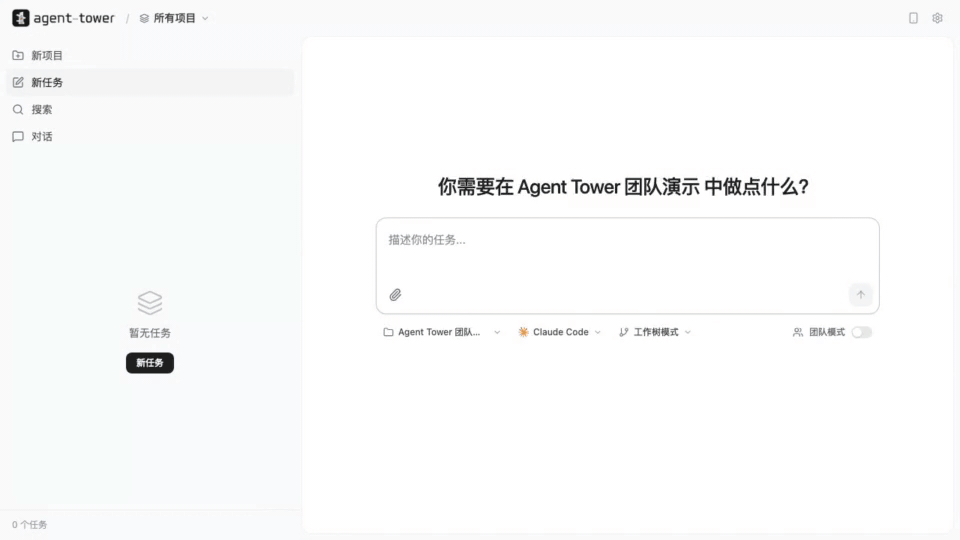

[English](./README.md) | **简体中文**

# Agent Tower

> Agent军团的指挥中心。

## 亮点功能

### 1. 看板隔离和多Agent支持

Agent-Tower支持不同的Agent厂商作为底层（Codex、Claude Code、Gemini Cli、 Kimi Cli、Cursor Cli...）, 想用哪个就用哪个。 以及设计了一套（待审查/运行中/已完成...）的状态机制，能够清晰的看到每个任务的状态，且每个任务的工作空间自动隔离，它们互不干扰。

<p align="center">
  
</p>

### 2. 团队模式（真正的多Agent协作）

团队模式下Agent可以互相合作，团队模式会创建一个群，每个Agent都是独立的成员，不会因为冗长的上下文信息污染导致任务偏离，Agent之间通过群聊交流协作：你可以设置负责人拆解任务，实施成员完成改动，审查成员检查质量，测试成员验证结果，任务最终完成后进入待审查。这套机制在保证任务结果的可用性上起到了很大作用，作者实测，它们甚至可以48小时不间断的合作完成一个复杂的任务，以下是一个简单的任务示例：

<p align="center">
  
</p>

## 为什么做这个项目

刚开始用 Claude Code 的时候，我开一个终端，无聊地等它吐完所有字符。后来我学聪明了——开多个终端，同时跑不同的任务，甚至同时开不同的项目。效率直接起飞，这可把我牛逼坏了。

爽了没两天，就发现了问题：

- **视觉混乱**：桌面上全是 Claude Code 终端，我经常搞不清楚哪个窗口是哪个任务。
- **编辑冲突**：多个任务改到同一个文件，合代码时一堆冲突。后来我用 Git Worktree 隔离每个任务，但手动输入命令做拆分、变基、合并，依然很繁琐。
- **手机访问**：总是坐在电脑前盯着终端，有时候挺枯燥的。我在阳台玩手机的时候，为什么不能看看我的 AI 牛马们干得怎么样了？
- **模型费用**：任务开多了，token 账单看得我肉疼。其实很多简单任务用便宜的模型就够了，但手动改配置太麻烦——就算用 ccswitch 之类的工具，也得等当前任务跑完才能切。

于是 Agent Tower 就这么被逼出来了——一个看板，把所有 Agent 的任务、终端、代码变更收到一个界面里。自动创建隔离分支、按任务选模型、手机远程访问、完成后通知你来 review。

## 核心能力

###  1. 一个看板管所有 Agent

不用再开一堆终端窗口了。所有项目、所有任务、所有 Agent，一个页面搞定。创建任务，选择 Agent，点击启动——输出、进度、代码变更实时可见。任务完成后自动流转到"待审查"，你来决定合不合并。

### 2. Git Worktree 自动隔离

每个任务自动创建独立 Git 分支，Agent 在各自的隔离环境中工作，从根本上杜绝代码冲突。完成后一键合并回主分支，变更视图里逐行审查。

### 3. 按任务选 Provider，省钱不费心

每个任务独立选择 Provider。翻译任务丢给 MiniMax，做计划用 Opus，执行交给 Codex——各司其职，不用等上一个任务跑完再切。Agent Tower 帮你把钱花在刀刃上。

### 4. 手机也能盯进度

Cloudflare 隧道一键开启，手机浏览器直接访问看板。出门在外也能看 Agent 跑到哪了。跑完了？桌面通知或飞书群消息提醒你来 review。

### 5. 支持主流 AI Agent

**Claude Code** · **Gemini CLI** · **Cursor Agent** · **Codex** · **Kimi CLi** · **Pi**  .....

不绑定单一厂商，用哪个顺手就用哪个。每个 Agent 支持自定义 Profile 配置变体。

### 6. MCP 协议集成

内置 MCP 服务器，Agent 能直接读取任务板、认领任务、报告进度。不只是你在管 Agent——Agent 也能主动协作。

## 快速开始

**推荐方式：全局安装**（最简单，一行命令搞定）

```bash
npm install -g agent-tower
agent-tower
```

打开 `http://localhost:12580`，开始使用。

> 前置要求：Node.js >= 22.19.0

### 配置 MCP（可选）

让 Claude Code 能直接操作任务板：

```json
{
  "mcpServers": {
    "agent-tower": {
      "command": "agent-tower-mcp",
      "args": [],
      "env": {
        "AGENT_TOWER_INTERNAL_TOKEN": "${env:AGENT_TOWER_INTERNAL_TOKEN}"
      }
    }
  }
}
```

如果开启了访问密码，MCP 调用后端会使用 `AGENT_TOWER_INTERNAL_TOKEN`，不会走浏览器 cookie。推荐从 Agent Tower 设置页复制生成的 MCP 配置，或用 MCP 客户端支持的 secret/env 方式注入这个变量。不要在共享配置里写死真实 token。

### 从源码开发

```bash
git clone https://github.com/agent-tower/core.git
cd agent-tower
pnpm setup          # 安装依赖 + 构建共享包
pnpm dev            # 启动所有服务的开发模式
```

## 架构概览

```
┌─────────────────────────────────────────────────┐
│                   浏览器 (React)                  │
│  看板页 ─ 终端视图 ─ 代码编辑器 ─ Git 变更视图      │
│  TanStack Query (服务端缓存) + Zustand (UI 状态)   │
└──────────────────┬──────────────────────────────┘
                   │ HTTP REST + Socket.IO (/events)
┌──────────────────┴──────────────────────────────┐
│                Fastify 服务端                      │
│  ┌───────────┐ ┌──────────┐ ┌────────────────┐  │
│  │ REST API  │ │ Socket.IO│ │  MCP Server    │  │
│  │ (16 路由) │ │ (实时通信) │ │ (Agent 集成)   │  │
│  └─────┬─────┘ └────┬─────┘ └───────┬────────┘  │
│        └──────┬──────┘               │           │
│        ┌──────┴──────┐               │           │
│        │   服务层     │               │           │
│        │ Session管理  │               │           │
│        │ Workspace   │               │           │
│        │ Git/Worktree│               │           │
│        │ 通知/隧道    │               │           │
│        └──────┬──────┘               │           │
│        ┌──────┴──────┐               │           │
│        │ AgentPipeline│              │           │
│        │ PTY + Parser │              │           │
│        │ + MsgStore   │              │           │
│        └──────┬──────┘               │           │
│               │ node-pty             │           │
│        ┌──────┴──────┐               │           │
│        │ Agent 执行器 │               │           │
│        │ Claude Code │               │           │
│        │ Gemini CLI  │               │           │
│        │ Cursor Agent│               │           │
│        │ Codex       │               │           │
│        └─────────────┘               │           │
│                                      │           │
│        ┌─────────────┐               │           │
│        │ SQLite      │◄──────────────┘           │
│        │ (Prisma ORM)│                           │
│        └─────────────┘                           │
└─────────────────────────────────────────────────┘
```

### 核心设计理念

**Agent 即团队成员**：Agent Tower 将 AI Agent 类比为团队成员。项目是工作空间，任务是工作项，Agent 是执行者。通过看板管理任务分配，通过终端监控执行过程，通过 Git 集成审查工作成果。

**Pipeline 架构**：每个 Agent Session 由 AgentPipeline 管理，包含三个核心组件：
- **PTY**：伪终端，负责与 Agent CLI 进程交互
- **Parser**：输出解析器，将 Agent 的原始输出结构化为工具调用、代码变更等
- **MsgStore**：消息存储，使用 JSON Patch 增量同步到前端

**Worktree 隔离**：每个任务创建独立的 Git Worktree，Agent 在隔离分支上工作，避免多个 Agent 同时修改代码造成冲突。

## 技术栈

| 层级 | 技术 |
|------|------|
| 前端 | React 19 + Vite 7 + TypeScript 5 |
| 样式 | TailwindCSS v4 + shadcn/ui (Radix UI) |
| 状态 | TanStack Query v5 + Zustand v5 |
| 终端 | xterm.js 5 + Monaco Editor |
| 后端 | Fastify 4 + Socket.IO 4 |
| 数据 | Prisma 5 + SQLite |
| 进程 | node-pty |
| 协议 | MCP (Model Context Protocol) |
| 包管理 | pnpm monorepo |

## 联系方式

如果你有任何问题或建议，欢迎加我微信交流：


## 许可证

本项目基于 Apache License 2.0 开源，详情见 [LICENSE](./LICENSE)。
