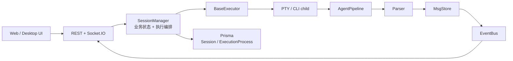
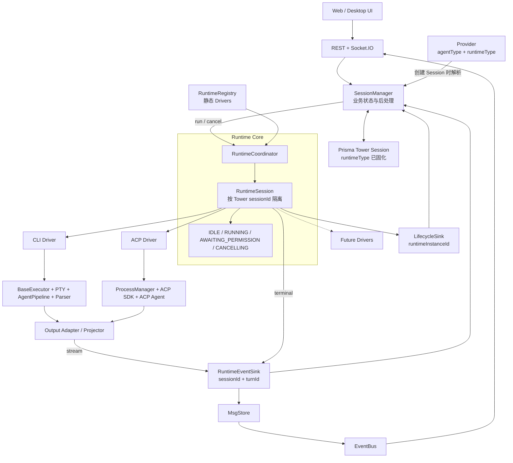

# ADR: Agent Runtime Core 与 Runtime Drivers

- 日期：2026-07-23
- 状态：Accepted
- 决策范围：Agent session 执行、CLI/ACP 接入、运行时生命周期
- 关联实施计划：`docs/plans/2026-07-23-acp-runtime-support-implementation.md`
- ACP 参考实现：`/Users/shitian/Work/shitian/test/.worktrees/at/ae4c61da`

## 1. 背景

Agent Tower 当前将 Agent 执行建模为 CLI 子进程。改造前的架构如下：



该模型适合一次启动一个 CLI、读取 stdout、解析结构化输出的 Agent。`SessionManager`
同时负责 Provider/Executor 选择、环境变量、进程登记、Pipeline map、Session 状态、快照、
auto-commit、Task 状态推进和 TeamRun reconciliation。

ACP 的运行方式不同：

- 通过 stdio 承载双向协议，而不是把 stdout 当作用户日志。
- 需要 initialize 和能力协商。
- 一个连接内存在 ACP session 和多个 turn。
- Agent 可以主动发起权限请求，Client 必须响应。
- 完成、取消、协议关闭和子进程退出是不同的生命周期信号。
- 连接可以跨 turn 保留，也可以在回收后通过 `session/load` 恢复。

若把 ACP 直接实现为 `BaseExecutor` 或 Parser，需要让双向协议伪装成 PTY 输出，并把权限、
连接恢复和能力协商继续塞进 `SessionManager`。这会扩大现有耦合，并妨碍未来接入 Codex App
Server、HTTP Agent 或远程 Runtime。

## 2. 决策

在 `SessionManager` 与具体 Agent 执行机制之间增加 Agent Runtime 层，并采用
**Runtime Core + Runtime Drivers** 架构。



### 2.1 改造前后对比

| 维度 | 改造前：CLI Pipeline | 方案 3：Runtime Core + Drivers |
| --- | --- | --- |
| 业务入口 | `SessionManager` 同时编排业务与 CLI 生命周期 | `SessionManager` 只调用统一 Runtime 契约 |
| 执行抽象 | `Executor -> PTY -> Pipeline` | `RuntimeSession -> CLI/ACP Driver` |
| 输出 | stdout 经 Parser 写入 MsgStore | Driver 事件经 Projector 写入同一 MsgStore |
| 生命周期 | Session、turn 和 process 大体重合 | Tower Session、RuntimeSession、turn、child process 明确分离 |
| 双向交互 | 主要是 terminal input | permission/cancel/capabilities 是 Runtime 一等能力 |
| 恢复 | CLI resume 由 Executor 特化处理 | Driver 按协商能力实现 resume 或 `session/load` |
| 扩展新协议 | 修改 `SessionManager` 并增加协议分支 | 注册新 Driver，业务后处理保持不变 |
| TeamRun 存活 | `hasActivePipeline()` | `hasActiveTurn()`，空闲连接不算执行中 |

最关键的变化不是把 PTY 换成 ACP，而是把“业务会话”和“执行协议”之间建立稳定边界：

```text
改造前：SessionManager -> CLI-specific Pipeline
方案 3：SessionManager -> Runtime Core -> CLI | ACP | Future Driver
```

### 2.2 Runtime 是执行边界，不是业务 Service

`SessionManager` 继续拥有：

- Tower Session、Task 和 TeamRun 的业务状态。
- Session generation 和 follow-up reservation。
- snapshot 持久化、token usage、auto-commit 和 commit message。
- Task 自动回退/推进和 TeamRun reconciliation。
- Provider 切换的业务校验。

Runtime Core 拥有：

- 按 Tower `sessionId` 管理内存 RuntimeSession。
- turn 状态机和 `turnId`。
- open、run、cancel、dispose 和 idle eviction。
- 能力协商后的运行时能力。
- 过滤旧 turn 的迟到事件。
- 服务关闭时有界、可等待的资源释放。

Runtime Driver 拥有：

- 具体协议的依赖发现、启动和连接。
- 创建/恢复外部 Agent session。
- 执行与取消一个 turn。
- 具体进程、连接和协议错误的清理。
- 将协议事件交给对应 Projector。

Projector 拥有：

- 把 CLI 或 ACP 事件映射为统一的 `RuntimeStreamEvent`。
- 生成 `NormalizedConversation` JSON Patch。
- 消息、tool、plan、usage 的稳定 identity 和增量更新。
- 对可进入日志、诊断或浏览器的内容做限长和脱敏。

CLI 首版由现有 Parser + MsgStore listener 承担 Projector 职责，不再叠加第二套解析；ACP 使用独立
Projector 把协议 update 映射为同一种 patch/event 契约。

Runtime 和 Driver 不直接更新 Prisma、Task 或 TeamRun。

### 2.3 三种身份必须分离

```text
Tower Session
  - 数据库中的长期业务会话
  - 可包含多个 turn

RuntimeSession
  - 以 Tower sessionId 为 key 的内存执行上下文
  - 可被回收和重建

External Session ID
  - Agent 侧 session/thread identity
  - 用于 CLI resume 或 ACP session/load
  - 必须独立持久化
```

Tower Session、RuntimeSession、OS process 和 ACP session 不建立一一对应假设。

### 2.4 Runtime 实例按 Tower Session 隔离

`RuntimeCoordinator` 使用以下逻辑模型：

```ts
Map<towerSessionId, RuntimeSession>
```

不按 Task、Workspace、Provider 或 AgentType 共享 RuntimeSession。TeamRun 可以在同一 Task 下并发
运行多个成员，共享只允许一个 active turn 的 ACP connection 会造成消息、权限和取消串线。

### 2.5 Provider 选择 Runtime，Session 固化选择

`AgentType` 表示 Agent 身份，例如 Codex 或 Claude Code；它不表示通讯协议。新增独立字段：

```ts
export type RuntimeType = 'CLI' | 'ACP'

export interface Provider {
  agentType: AgentType
  runtimeType?: RuntimeType
}
```

- 旧 Provider 缺少 `runtimeType` 时按 `CLI` 解释。
- 创建 Tower Session 时把最终 `runtimeType` 写入 Session。
- 修改 Provider 不得使已存在 Session 在下一轮隐式切换 Runtime。
- 同一 Tower Session 的 Provider 切换必须保持 AgentType 和 RuntimeType 一致。
- CLI 与 ACP 之间的切换创建新的 Tower Session，不伪装成原会话的 follow-up。

### 2.6 RuntimeSession 使用统一 turn 状态机

最低状态集合：

```text
IDLE
  -> RUNNING
  -> AWAITING_PERMISSION
  -> RUNNING
  -> CANCELLING
  -> IDLE
  -> DISPOSED
```

打开连接和失败清理可以有内部过渡状态，但不扩散为新的 Prisma `SessionStatus`。
Tower Session 在等待权限时仍为 `RUNNING`；细粒度 turn 状态属于 Runtime authoritative state。

每轮生成不可复用的 `turnId`。所有 turn 范围内的 Driver/Projector 事件携带
`towerSessionId + turnId`。Runtime Core 丢弃已取消、已完成或被后续 turn 替代的迟到事件，避免旧
PTY completion 或旧 ACP completion 污染新一轮。跨 turn 的 child process/connection 生命周期使用独立
`runtimeInstanceId`，不能伪装成某个 turn 的完成事件。

### 2.7 Runtime 契约按 session/turn 建模

目标契约形状如下，具体字段在实施阶段由测试固化：

```ts
interface RuntimeDriver {
  readonly type: RuntimeType
  checkAvailability(input: RuntimeAvailabilityInput): Promise<AvailabilityInfo>
  open(input: OpenDriverSessionInput): Promise<DriverSession>
}

interface DriverSession {
  readonly externalSessionId?: string
  readonly capabilities: RuntimeCapabilities
  runTurn(input: RunTurnInput, sink: RuntimeEventSink): Promise<TurnOutcome>
  cancelTurn(turnId: string): Promise<void>
  close(): Promise<void>
}
```

接口不暴露 PTY、stdin、ACP SDK context 或原始 JSON-RPC frame。CLI 特有的 terminal input/resize
通过 capability-gated 可选操作表达，不作为所有 Runtime 的必选能力。

### 2.8 统一事件出口

Driver 在 turn 运行期间只能写入非终态事件：

```ts
type RuntimeStreamEvent =
  | { type: 'conversation_patch'; patch: JsonPatch }
  | { type: 'external_session_id'; externalSessionId: string }
  | { type: 'permission_requested'; request: RuntimePermissionRequest }
  | { type: 'permission_invalidated'; requestId: string }
  | { type: 'usage'; usage: TokenUsage }
  | { type: 'progress' }
```

`runTurn()` 的 promise settlement 是 Driver 向 Runtime Core 报告 turn 结果的唯一来源。Runtime Core
再把它转换为一次性的终态事件：

```ts
type RuntimeTerminalEvent =
  | { type: 'completed'; outcome: RuntimeTurnOutcome }
  | { type: 'failed'; error: RuntimeError }
```

所有 turn 事件都有 envelope：

```ts
interface RuntimeTurnEventEnvelope {
  towerSessionId: string
  turnId: string
  sequence: number
  timestamp: string
  event: RuntimeStreamEvent | RuntimeTerminalEvent
}
```

Runtime Core 保证单个 turn 的 sequence 单调递增和终态 exactly-once。MsgStore 继续保证 patch `seq`
单调递增以及 snapshot/reconnect 语义；Runtime sequence 不替代 MsgStore patch seq。Driver 不同时通过
sink 和 promise 上报终态，避免 prompt completion、PTY exit 和 connection close 形成两个完成来源。

child process 和 connection 的启动、退出属于 RuntimeSession 生命周期事件，使用
`towerSessionId + runtimeInstanceId` 关联，不进入上述 turn envelope。这样 ACP child 在 turn 完成后退出，
或旧 RuntimeSession 的退出通知迟到时，都不会被解释成当前 turn 的终态。

### 2.9 CLI Driver 保留现有不变量

CLI Driver 包装现有 `BaseExecutor`、`AgentPipeline`、Parser 和 MsgStore，不在第一阶段重写它们。

必须保留：

- spawn 到 attach 之间的 early PTY event handoff。
- raw stdout 先保存、Parser 失败仍可恢复的兜底。
- Parser `finish()` exactly-once。
- logical completion/failed 与 PTY exit 的终态竞争处理。
- follow-up 与 auto-commit generation 的串行边界。
- Windows ConPTY、临时 stdin 文件和跨平台进程清理。

### 2.10 ACP Driver 不暴露原始协议流

ACP stdout 是协议通道，不发送 `session:stdout`，不写入普通日志快照。ACP Driver 必须：

- 校验 NDJSON frame 和单帧大小。
- 对 stderr、诊断、tool input/output 和未知 update 做脱敏与限长。
- initialize 后以协商能力为准，不按文档或 AgentType 推断能力。
- 区分 prompt completion、cancel settlement、connection close 和 child exit。
- 使用进程组有界关闭，正常退出和强制退出只产生一次终态。
- 未实现 Client filesystem/terminal callbacks 时不声明相应 capability。

### 2.11 ExecutionProcess 记录真实 child 生命周期

`ExecutionProcess` 是 OS child process 的持久化记录，不是 turn 记录。Runtime/Driver 不直接访问
Prisma；`SessionManager` 根据 Runtime Core 提供的进程生命周期通知维护记录。

- 每次真实 child 启动创建一条记录，并用该记录 ID 关联后续退出；不能只用 Tower Session 推断。
- child 存活期间 `exitCode` 保持为空，真实退出时才更新；turn completion 不更新 `exitCode`。
- ACP child 可以跨多个 turn 保持存活，Tower Session 暂时为 `COMPLETED` 时进程也可以仍处于空闲连接状态。
- cancel 一个 turn 不等于 child 已退出；只有 close/kill 后观察到真实退出，才结束进程记录。
- RuntimeSession 回收后重新连接会启动新的 child，并创建新的 `ExecutionProcess`，不复用旧记录。
- 旧 RuntimeSession 的迟到 process exit 只结束自己的记录，不得改变新 turn 或新 RuntimeSession 的状态。

首版可沿用现有 `pid`、`exitCode`、`createdAt`、`updatedAt` 字段；若产品需要精确展示退出时间、signal
或 runtime kind，应在持久化阶段显式加字段，不能用 turn terminal time 冒充 process exit time。

### 2.12 权限是 Runtime 状态，不是普通日志

ACP permission request 持有未完成的协议请求。服务端 `PermissionRegistry` 保存：

```text
towerSessionId + turnId + requestId
+ exact option IDs
+ sanitized tool summary
+ resolver / abort signal
```

- Runtime Core 校验 request 所属 session、turn 和 option ID。
- `ASK` 模式通过 Socket 通知，REST mutation 提交选择。
- reconnect 后前端通过 REST runtime state 获取 authoritative pending permission。
- `AUTO_APPROVE` 在服务端执行，不依赖浏览器在线。
- stop、turn cancel、ACP connection close、turn terminal 和 server shutdown 都使 permission 失效。
- Browser/Socket 断线不使 permission 失效；浏览器重连后仍通过 REST 读取 pending state。
- resolver 不持久化；server 重启后旧 permission 不可恢复。

### 2.13 ACP 与 TeamRun

- 每个 TeamRun invocation 使用独立 Tower Session 和 RuntimeSession。
- Agent Tower MCP 通过 ACP `session/new` 和 `session/load` 的 `mcpServers` 显式传入。
- TeamRun identity 和 internal token 只进入该 MCP server 的 env，不接受 Agent 自报身份。
- 当前 `AgentInvocationStatus` 没有 `PENDING_APPROVAL`。permission pending 时 Invocation 保持
  `RUNNING`，Runtime turn state 为 `AWAITING_PERMISSION`，TeamMember 聚合状态派生为
  `PENDING_APPROVAL`；处理后 Member 恢复为 `RUNNING`。不要复用 WorkRequest 的
  `PENDING_APPROVAL`，也不要在没有独立状态模型变更的情况下写入 Invocation。
- RuntimeCoordinator 提供只读、可批量查询的 runtime state view，供 TeamRun DTO 和 watchdog 按
  invocation 的 `sessionId` 读取；permission 请求和失效同时触发 TeamRun invalidation。
- `AWAITING_PERMISSION` 仍是 active turn，但 watchdog 在该状态暂停 Agent 静默补催。权限处理后重置
  补催计时；这属于控制状态变化，不记作 Agent progress。
- TeamRun heartbeat 以 Agent 的 message/tool/plan/usage/progress 为依据，不能把本地 user patch 当作进展。
- `hasActivePipeline()` 语义迁移为 `hasActiveTurn()`，不能把空闲但仍连接的 ACP Runtime 当作运行中成员。

### 2.14 恢复和空闲回收

ACP follow-up 顺序：

1. 内存 RuntimeSession 和 ACP session 仍存在时直接继续。
2. Runtime 已回收时重新连接并重新 initialize。
3. Agent 声明 `session/load` 时加载持久化 external session ID。
4. Agent 不支持 load 时，不声称恢复成功；由上层显式决定是否创建新 Agent session。

Runtime Core 可以对 `IDLE` RuntimeSession 设置 TTL 和总量上限。以下状态不能被 idle eviction：

- `RUNNING`
- `AWAITING_PERMISSION`
- `CANCELLING`

TTL、上限和无 load 能力时的产品行为在 ACP 上线前通过实施计划中的探针确定。

## 3. 被拒绝的方案

### 3.1 把 ACP 作为新的 AgentType

拒绝。ACP 是通讯协议/执行后端，不是 Agent 身份。同一 Codex Provider 应能选择 CLI 或 ACP。

### 3.2 把 ACP 实现为 BaseExecutor 和 Parser

拒绝。该方案让双向 RPC 伪装为单向 stdout，无法清晰表达权限、能力、连接与 session/load。

### 3.3 在 SessionManager 中直接增加 CLI/ACP 双分支

拒绝作为目标架构。它可以快速验证，但会复制 start、follow-up、cancel、terminal gate、shutdown 和
TeamRun 存活逻辑，使 `SessionManager` 继续增长。

### 3.4 直接建设动态 Runtime 插件平台

暂不采用。Runtime Driver 保留扩展点，但第一版只做仓库内静态 registry。第三方插件的版本、签名、
权限、安装和崩溃隔离不属于 ACP 接入范围。

## 4. 结果与代价

正向结果：

- CLI 与 ACP 生命周期获得明确边界。
- SessionManager 不再依赖所有协议细节。
- ACP 权限和恢复成为一等能力。
- TeamRun 并发隔离可以复用统一 Runtime 语义。
- 后续接入 App Server、HTTP 或远程 Agent 不需要再次重写业务层。

代价：

- CLI 现有链路需要先包装进 Runtime Driver，必须有完整回归测试。
- Runtime turn sequence、MsgStore patch seq 和 Session generation 三者需要明确区分。
- ACP adapter 的固定版本、打包和 Node 兼容成为新的发布责任。
- 空闲 Runtime 会增加进程和内存占用，需要 TTL、总量限制和诊断。
- `SessionManager`、TeamRun watchdog 和 server shutdown 存在跨模块迁移成本。

## 5. 不变量

实现必须始终满足：

1. 一个 Tower Session 同时最多有一个 active turn。
2. 一个 RuntimeSession 只属于一个 Tower Session。
3. 一个 turn 只产生一个 completed 或 failed 终态。
4. 旧 turn 的事件不能影响新 turn。
5. Runtime/Driver 不直接推进 Task 或 TeamRun 业务状态。
6. ACP 原始 frame、完整环境变量、Provider secret 和 internal token 不进入浏览器或日志快照。
7. Server shutdown 必须等待 ACP/CLI 资源有界清理。
8. 旧 Provider 和旧 Session 默认继续使用 CLI。
9. Socket 只负责实时通知，重连后以 REST/snapshot 为 authoritative state。
10. WORKTREE、MAIN_DIRECTORY、Solo 和 TeamRun 都使用后端返回的真实 workingDir。

## 6. 非目标

- 不在首版开放第三方 Runtime 插件安装。
- 不在首版实现 ACP Client filesystem/terminal callbacks。
- 不在首版扩展新的 AgentType catalog。
- 不用 ACP 替换 Agent Tower MCP。
- 不改变 Task、Workspace 和 TeamRun 的业务模型。
- 不在 ADR 阶段承诺某个未探针验证的 adapter 或 Node 最低版本。

## 7. 上线前待确认项

以下是实施决策，不改变本 ADR 的架构结论：

1. 第一批 ACP Agent 范围，建议先 Codex，再 Claude Code、Gemini CLI、Cursor Agent。
2. ACP Provider 默认 permission mode。
3. Node 18/20/22 的实际兼容矩阵，或是否提升最低 Node 版本。
4. adapter 作为 server dependency、optional dependency 或 bundled resource 的分发策略。
5. idle TTL、最大空闲 Runtime 数量和无 `session/load` 时的产品交互。
